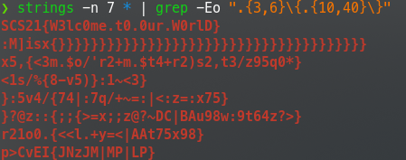

# Hidden Data In PDF File

> Author : jul0105
> Date : 01.03.2021


## Challenge info

**Release** : Bundle 1 (01.03)

**Difficulty** : Easy

**Goal** :

- Analyze the given PDF file
- find the flag


## Solve

Firstly, as I generally do with stenography challenges, I use `binwalk` to extract contents from the file :

```
binwalk -Me 1b3760fb-fefb-434f-84b9-b02746dea0c4.pdf
```

This command extract potential files hidden in the source file recursively.


Files extracted :


Even though a lot of files have been extracted, they seems to be all binary. 


I try to use strings to display sequences of printable characters and then filter to result with grep to only show flag-formatted strings. This is what the command looks like :

```bash
strings -n 7 * | grep -Eo ".{3,6}\{.{10,40}\}"
```

`strings` :

- `-n 7` : Only print sequences of 7 characters or more
- `*` : Read only files in the current directory

`grep` :

- `-E` : Use extended regexp
- `-o` : Print only the matching bytes
- `".{3,6}\{.{10,40}\}"` : Regexp used to search for a CTF flag. Flags are generally formatted like that :`<EVENT NAME>{<FLAG>}` where the event name is generally short (3 to 6 characters) and the flag much longer (10 to 40 characters).


This command allowed me to get following flag :



Flag : 

```
SCS21{W3lc0me.t0.0ur.W0rlD}
```